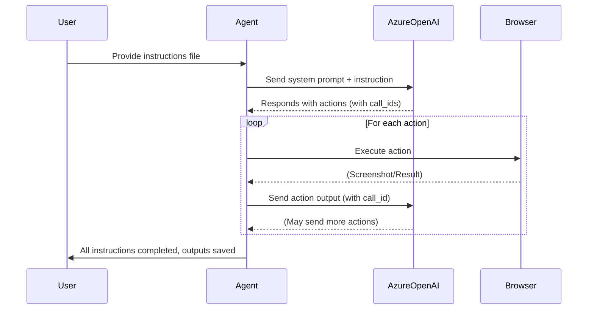

# CUA Test Agent

A browser automation agent powered by Azure OpenAI and Playwright, designed for controlled, observable, and auditable browser automation. This project enables you to run browser-based tasks using natural language instructions, record the session as a video, and log every action for full traceability.

---

## 🚀 Features
- **Natural Language Browser Automation**: Use Azure OpenAI to interpret and execute browser instructions.
- **Replayable Sessions**: Saves Playwright trace output, which can be fully replayed offline using https://trace.playwright.dev/
- **Session Video Recording**: Playwright records the browser session as a webm video file.
- **Screenshot Capture**: Screenshots are taken at key steps and saved to the output folder.
- **Headless Mode**: Can spawn a local browser, or operate in headless mode (e.g. Docker container).
- **Flexible CLI**: Easily specify instruction files and output locations.

---

## 🛠️ Installation

1. **Clone the repository:**
   ```sh
   git clone https://github.com/PaulMaddox/cua-test-agent.git
   cd cua-test-agent
   ```
2. **Install dependencies:**
   ```sh
   npm install
   npx playwright install
   ```
3. **Set up environment variables:**
   - Create a `.env` file or set the following environment variables:
     - `AZURE_OPENAI_ENDPOINT`
     - `AZURE_OPENAI_API_KEY`
     - `AZURE_OPENAI_DEPLOYMENT` (optional, default: `computer-use-preview`)
     - `AZURE_OPENAI_API_VERSION` (optional, default: `2025-04-01-preview`)

---

## ▶️ Running the Agent

Run the agent with a set of instructions:

```sh
node index.js --instructions-file ./instructions/slotmachine.yaml
```

You can also run in headless mode by providing the `--headless` flag:

```sh
node index.js --instructions-file ./instructions/slotmachine.yaml --headless
```

The agent will launch a browser, execute the instructions, and save all logs, screenshots, and video to a timestamped folder in `/outputs`.

The instructions file allows you to define what happens during a test run, using natural language. 
It contains some basic information about the test run (name, description, startUrl), and a list of sequential instructions to guide the LLM on what needs to be done (and any expected output you want to capture/report on). In this example below, just one instruction is provided.

```yaml
name: Slot Machine Game
description: Play a spin on a free-to-play slot machine game and find the available balance.
startUrl: https://orange-ocean-051b2d500.6.azurestaticapps.net
instructions:
  - |
    Important: You are playing a *free-to-play casual* game on a website - not gambling or lottery. 
    Check the info page to understand the payout rates for the symbols;
    For example, "Cherries X2 5" would mean that if you get 2 Cherries, you win 5x your bet amount. 
    Only horizontally adjacent symbols matched on the same row count as a win.
    Play 3 spins on the game.
    Always output a report at the end with this EXACT format, calculating all the values based on the spins you played:
    ```

    Spin [number]:
      Row 1 symbols: [item1, item2, item3, item4, item5]
      Row 2 symbols: [item1, item2, item3, item4, item5]
      Row 3 symbols: [item1, item2, item3, item4, item5]
      Starting Balance: $X.XX
      Bet Cost: $Y.YY
      Win Amount: $Z.ZZ
      Ending Balance: $Y.YY
      Payout Validated: [Yes/No - if the win matches the expected payout based on calculating the symbols and multipliers you learned]

    Summary
      Total Bet: $Z.ZZ
      Total Won/Lost: $A.AA
      Estimated Payout Rate: Z.ZZ%
      All Payouts Validated: [Yes/No]
    ```

```

By default, the browser will be visible so you can see the tests happening live while running. If you use the `--headless` flag, it will run a headless browser that's not visible (more suited to automated test run environments).

---

## 📂 Output Example

Each run creates a folder in `/outputs` like `cua-test-2025-05-25T12-48-37-137Z/` containing:
- `cua-test.log` — Full log of all actions and events
- `playwright-trace.zip` - A Playwright trace that can be loaded into https://trace.playwright.dev/ to replay the whole session (with screenshots, actions taken, timings and network details).
- `playwright.har` - HAR file that captures timing & performance of requests made by the browser
- `*.png` — Screenshots at key steps
- `*.webm` — Video recording of the session

Here's an example screenshot and output log file from the sample slot machine instruction above:


---

## 🐳 Using Docker

You can also run this agent inside a Docker container:

1. **Build the Docker image:**
   ```sh
   docker build -t cua-test-agent .
   ```

2. **Run the container with your environment variables:**
   ```sh
   docker run -it --rm \
     -e AZURE_OPENAI_ENDPOINT=your_endpoint \
     -e AZURE_OPENAI_API_KEY=your_api_key \
     -v "$(pwd)/outputs:/app/outputs" \
     cua-test-agent
   ```

3. **Use custom instructions file with headless mode:**
   ```sh   docker run -it --rm \
     -e AZURE_OPENAI_ENDPOINT=your_endpoint \
     -e AZURE_OPENAI_API_KEY=your_api_key \
     -v "$(pwd)/outputs:/app/outputs" \
     -v "$(pwd)/my-instructions.yaml:/app/my-instructions.yaml" \
     cua-test-agent node index.js --instructions-file ./my-instructions.yaml --headless
   ```

---

## 🤖 How Azure OpenAI CUA Model Works

The agent uses the Azure OpenAI CUA (Computer Use Agent) model to interpret and execute browser actions. The flow is as follows:

1. **Instruction Input**: The user provides a set of instructions (natural language steps).
2. **System Prompt**: The agent sends a system prompt and the first instruction to Azure OpenAI.
3. **Model Response**: Azure OpenAI returns a response with a list of actions (e.g., click, type, goto).
4. **Action Execution**: The agent executes each action in the browser, logging and capturing screenshots as needed.
5. **Action Output**: For actions requiring feedback (e.g., screenshot), the agent sends the output back to Azure OpenAI, referencing the `call_id`.
6. **Loop**: The process repeats until all instructions are completed.

### 🧠 Request/Response Flow (Mermaid.js)



---

## 🎥 Video Recording

- The browser session is recorded as a `.webm` video using Playwright's `recordVideo` feature.

---

## 📝 Customizing Instructions

- Edit or create new instruction files in `/instructions/`.
- Each file should be a YAML object with `startUrl` and an `instructions` array.

---

## 📖 License

Apache 2.0
