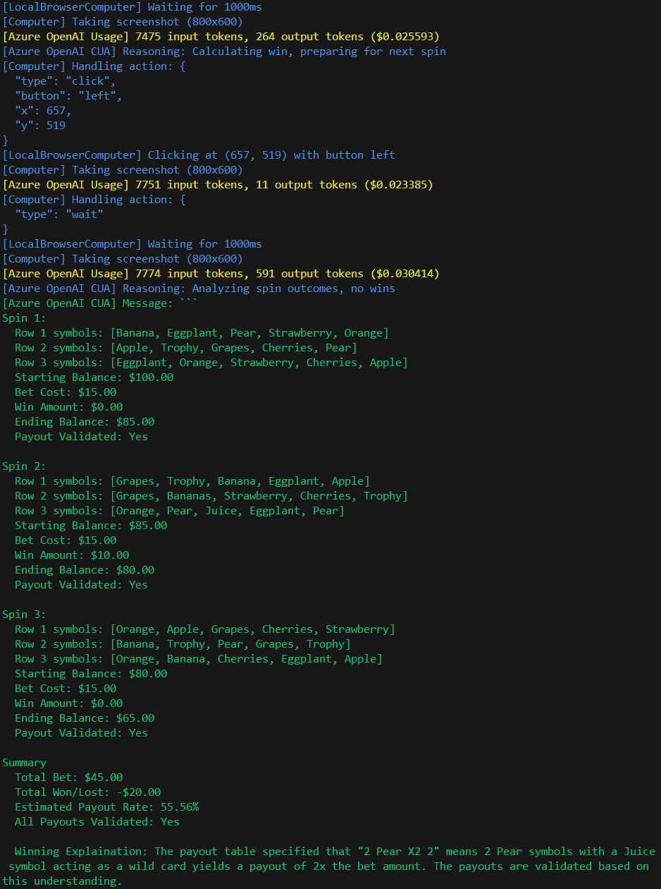

# CUA Test Agent

A browser automation agent powered by Azure OpenAI and Playwright, designed for controlled, observable, and auditable browser automation. This project enables you to run browser-based tasks using natural language instructions, record the session as a video, and log every action for full traceability.

---

## 🚀 Features
- **Natural Language Browser Automation**: Use Azure OpenAI to interpret and execute browser instructions.
- **Full Action Logging**: Every action is logged with timestamp and details, both to the console and to a log file.
- **Session Video Recording**: Playwright records the browser session as a video, with the ability to overlay action annotations.
- **Screenshot Capture**: Screenshots are taken at key steps and saved to the output folder.
- **Flexible CLI**: Easily specify instruction files and output locations.

---

## 🛠️ Installation

1. **Clone the repository:**
   ```sh
   git clone https://github.com/PaulMaddox/cua-test-agent.git
   cd cua-test-agent
   ```
2. **Install dependencies:**
   ```sh
   npm install
   npx playwright install
   ```
3. **Set up environment variables:**
   - Create a `.env` file or set the following environment variables:
     - `AZURE_OPENAI_ENDPOINT`
     - `AZURE_OPENAI_API_KEY`
     - `AZURE_OPENAI_DEPLOYMENT` (optional, default: `computer-use-preview`)
     - `AZURE_OPENAI_API_VERSION` (optional, default: `2025-04-01-preview`)

---

## ▶️ Running the Agent

Run the agent with a set of instructions:

```sh
node index.js --instructions-file ./instructions/slotmachine.json
```

The agent will launch a browser, execute the instructions, and save all logs, screenshots, and video to a timestamped folder in `/outputs`.

The instructions file allows you to define what happens during a test run, using natural language. 
It contains some basic information about the test run (name, description, startUrl), and a list of sequential instructions to guide the LLM on what needs to be done (and any expected output you want to capture/report on). In this example below, just one instruction is provided.

```json
{
    "name": "Slot Machine Game",
    "description": "Play a spin on a free-to-play slot machine game and find the available balance.",
    "startUrl": "https://orange-ocean-051b2d500.6.azurestaticapps.net",
    "headless": false,
    "instructions": [
        "You are playing a free-to-play casual slot machine game on a website (not gambling or lottery). Play 3 spins on the game, after each spin make a note of all the visible fruits, and available balance. Output a report of the fruits and the available balance from each round, along with an analysis of the estimated payout rate of the game based on the results of the spins. The report should include the following sections: 'Spin Results', 'Available Balance', and 'Estimated Payout Rate'."
    ]
}
```

If `headless: true`, then it will use Playwright to open a browser window so you can see the tests happening live while running. Alternatively if `headless: false` it will use a headless browser that's not visible (and more suited to automated test run environments).

---

## 📂 Output Example

Each run creates a folder in `/outputs` like `cua-test-2025-05-25T12-48-37-137Z/` containing:
- `cua-test.log` — Full log of all actions and events
- `playwright.har` - HAR file that can be used to measure timing & performance of HTTP within the browser
- `*.png` — Screenshots at key steps
- `*.webm` — Video recording of the session

Here's an example screenshot and output log file from the sample slot machine instruction above:



---

## 🤖 How Azure OpenAI CUA Model Works

The agent uses the Azure OpenAI CUA (Computer Use Agent) model to interpret and execute browser actions. The flow is as follows:

1. **Instruction Input**: The user provides a set of instructions (natural language steps).
2. **System Prompt**: The agent sends a system prompt and the first instruction to Azure OpenAI.
3. **Model Response**: Azure OpenAI returns a response with a list of actions (e.g., click, type, goto).
4. **Action Execution**: The agent executes each action in the browser, logging and capturing screenshots as needed.
5. **Action Output**: For actions requiring feedback (e.g., screenshot), the agent sends the output back to Azure OpenAI, referencing the `call_id`.
6. **Loop**: The process repeats until all instructions are completed.

### 🧠 Request/Response Flow (Mermaid.js)


---

## 🎥 Video Recording

- The browser session is recorded as a `.webm` video using Playwright's `recordVideo` feature.

---

## 📝 Customizing Instructions

- Edit or create new instruction files in `/instructions/`.
- Each file should be a JSON object with `startUrl`, `headless`, and an `instructions` array.

---

## 📖 License

Apache 2.0